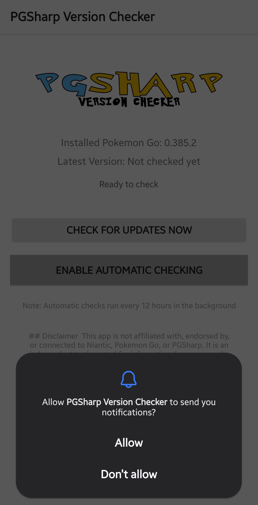
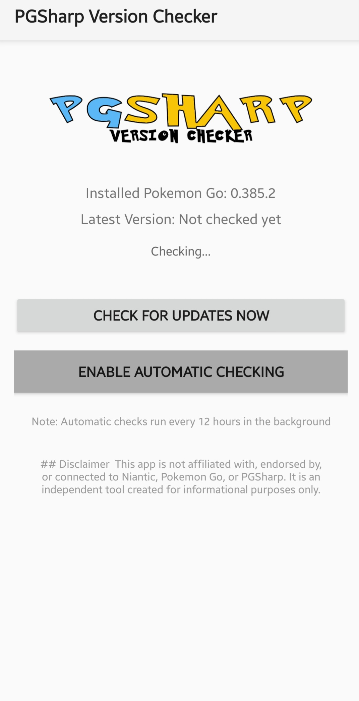
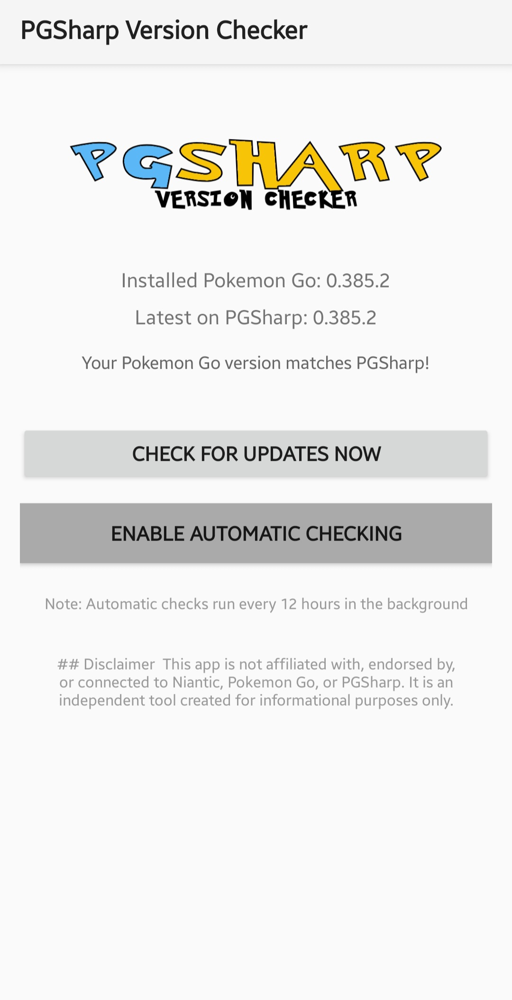
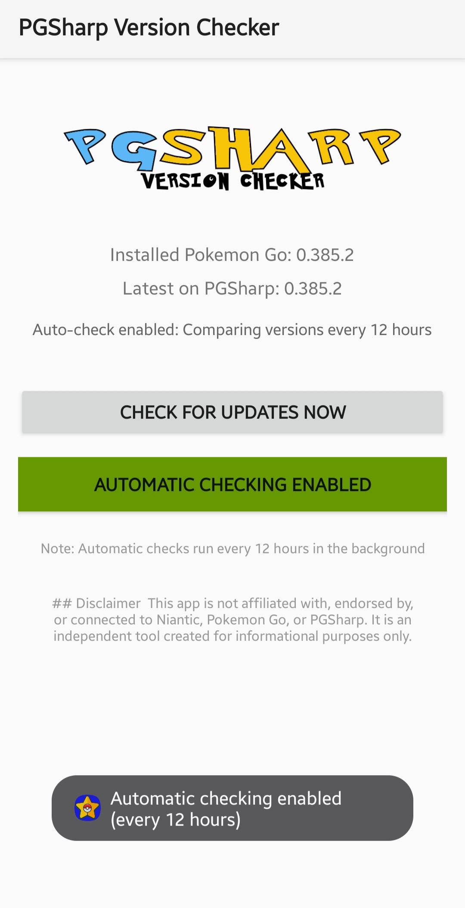

# PGSharp Version Checker

An Android app that monitors your installed Pokemon Go version and compares it against the latest version supported by PGSharp.

## Features

- 🔍 **Automatic Detection** - Detects your installed Pokemon Go version
- 🌐 **Web Scraping** - Fetches the latest supported version from pgsharp.com
- 🔔 **Notifications** - Alerts you when there's a version mismatch
- ⏰ **Background Checking** - Automatic checks every 12 hours
- 📱 **Manual Check** - Check for updates anytime with one tap

## Screenshots

<p align="center">
  
  
  
  
</p>

## How It Works

1. The app reads your installed Pokemon Go version from the package manager
2. It scrapes pgsharp.com to get the latest Pokemon Go version that PGSharp supports
3. Compares the two versions and notifies you if they differ
4. Runs automatic checks in the background every 12 hours (optional)

## Installation

### Requirements
- Android 7.0 (API 24) or higher
- Pokemon Go installed on your device

### Install from APK
1. Download the latest APK from the [Releases](../../releases) page
2. Enable "Install from Unknown Sources" in your Android settings
3. Install the APK
4. Grant notification permissions when prompted

### Build from Source
1. Clone this repository
2. Open the project in Android Studio
3. Build and run on your device

```bash
git clone https://github.com/jPHatDesigns/pgsharpchecker.git
cd pgsharpchecker
```

## Permissions

The app requires the following permissions:

- **INTERNET** - To fetch version information from pgsharp.com
- **POST_NOTIFICATIONS** - To send update notifications
- **Package Visibility** - Uses `<queries>` to detect Pokemon Go (less invasive than QUERY_ALL_PACKAGES)

## Usage

1. Open the app
2. The app will automatically detect your Pokemon Go version
3. Tap "Check for Updates Now" to manually check the latest version
4. Tap "Enable Automatic Checking" to enable background checks every 12 hours
5. You'll receive a notification if your version differs from PGSharp's supported version

## Technical Details

- **Language**: Kotlin
- **Minimum SDK**: 24 (Android 7.0)
- **Target SDK**: 34 (Android 14)
- **Architecture**: MVVM with WorkManager for background tasks
- **Libraries**:
  - AndroidX WorkManager - Background task scheduling
  - Jsoup - HTML parsing for web scraping
  - Kotlin Coroutines - Asynchronous operations

## Contributing

Contributions are welcome! Please feel free to submit a Pull Request.

## License

This project is licensed under the MIT License - see the [LICENSE](LICENSE) file for details.

## Disclaimer

This app is not affiliated with, endorsed by, or connected to Niantic, Pokemon Go, or PGSharp. It is an independent tool created for informational purposes only.

## Support

If you encounter any issues or have suggestions, please [open an issue](../../issues).
